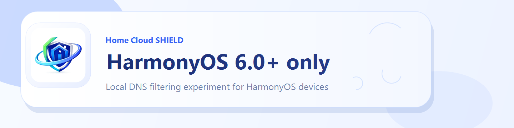
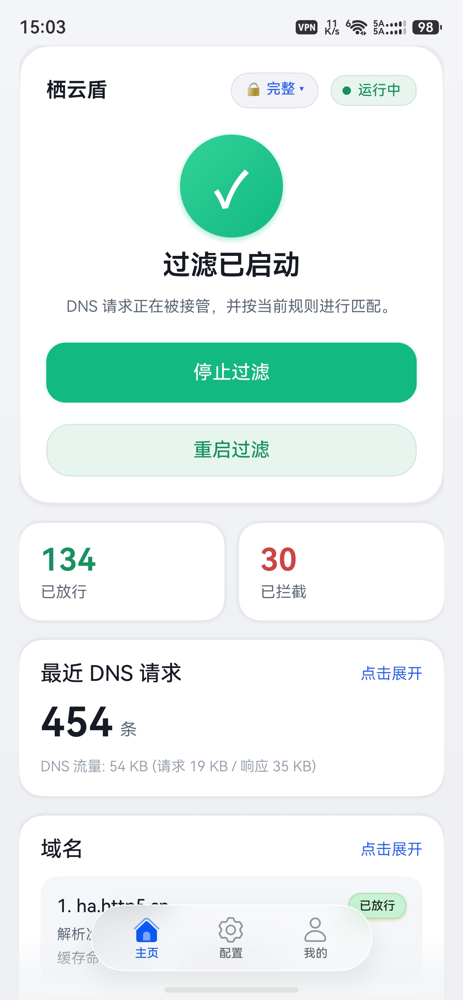
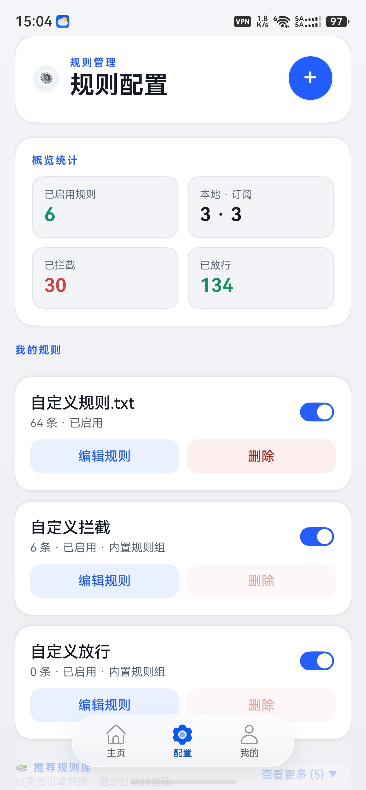
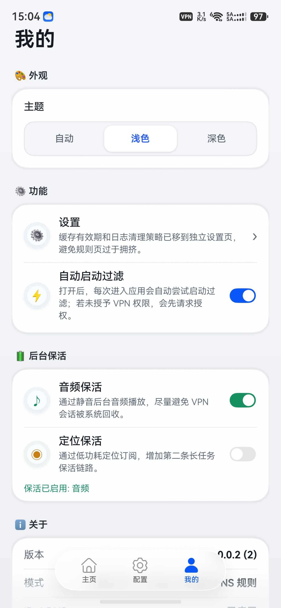
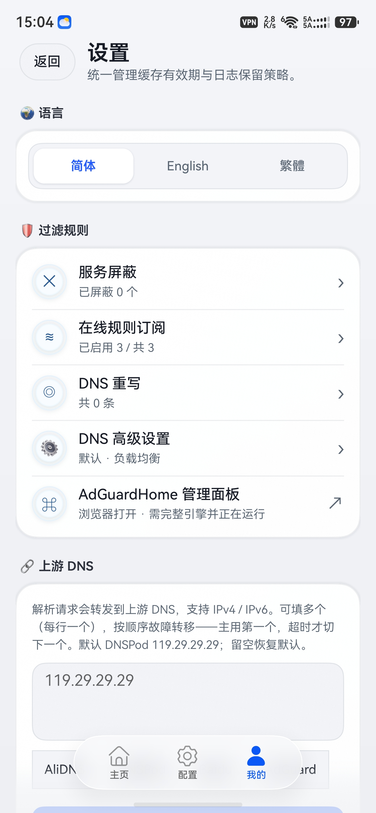
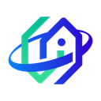

# home_cloud_shield / Qiyun Shield

[简体中文](./README.md) | [English](./README-en.md)

<p align="center">
	
</p>


`home_cloud_shield` is a local DNS filtering app for **HarmonyOS 6.0+**: it intercepts DNS traffic through a **local VPN** or a **pure DNS proxy**, blocks ad and tracking domains with **AdGuard-style rules**, and ships a **dual filtering engine** (lightweight / full AdGuardHome).

Project URL: <https://github.com/Tlntin/home-cloud-shield> | Current version: **v0.0.9** ([Changelog](#changelog))

## Table of Contents

- [Highlights](#highlights)
- [Screenshots](#screenshots)
- [Get and Install](#get-and-install)
- [Changelog](#changelog)
- [Engines and Network Modes](#engines-and-network-modes)
- [Rule Compatibility](#rule-compatibility)
- [Current Limitations](#current-limitations)
- [Disclaimer](#disclaimer)
- [Quick Start and Build](#quick-start-and-build)
- [Open Source and License](#open-source-and-license)
- [Other Apps You May Like](#other-apps-you-may-like)

## Highlights

- **Dual filtering engine**: lightweight (default, low power) / full (embedded AdGuardHome core), switchable from a dropdown on the home page.
- **Dual network mode**: VPN mode (device-wide DNS takeover) / pure DNS proxy mode (no VPN slot used, **coexists with another VPN / proxy app**).
- **Works on Wi-Fi too**: Wi-Fi-provided resolvers and common public DNS are captured automatically, with re-adaptation on Wi-Fi ↔ cellular switches (fixed in v0.0.5).
- **Rule management**: import / edit / toggle / export AdGuard-style DNS rules; plus **whole-config JSON import / export** (compatible with the `adguard.json` of the "AdGuard content blocker" app).
- **Full-mode-only capabilities**: blocked services (one-tap block of common services), **local management of online subscriptions** (subscribing / importing downloads the list to a local cache and validates it; view content, one-tap refresh, check usability; with a recommended library), DNS rewrites, advanced DNS settings (blocking mode / upstream mode / cache / DNSSEC / rate limit), and the AdGuardHome dashboard.
- **Logs and stats**: SQLite-backed persistent DNS query log; "allowed / blocked" counters accumulate across restarts; tapping a card jumps straight to the matching filtered list; plus domain rankings, debug logs, and a **persistent status-bar notification** (live Blocked / Allowed / Total counts, off by default to save battery).
- **More**: custom upstream DNS (IP presets AliDNS / DNSPod / Baidu / AdGuard, plus DoH / DoT and other encrypted upstreams on the full engine), **automatic upstream that follows the system / router** (VPN mode), background keep-alive, light/dark theme, and instant in-app switching between Simplified Chinese / English / Traditional Chinese.

## Screenshots

| Home | Config | Me | Settings |
| --- | --- | --- | --- |
|  |  |  |  |

## Get and Install

Grab a package from **Releases**: <https://github.com/Tlntin/home-cloud-shield/releases>

It is also available from a third-party app site: <https://sydxky.cn/detail.php?id=575>

[Auto-Installer](https://github.com/likuai2010/auto-installer/releases/latest) and [HO-Kit](https://sydxky.cn/hokit.php) are the recommended ways to install Release packages; you can also build the app yourself with **DevEco Studio** (see [Quick Start and Build](#quick-start-and-build)).

<details>
<summary>Auto-Installer tutorials</summary>

Auto-Installer is a free, cross-platform HarmonyOS app deployment and debugging tool, well suited for installing packages downloaded from Releases.

- [Guide document (PDF)](https://github.com/Zitann/HarmonyOS-Haps/raw/refs/heads/main/assets/guide.pdf)
- [Video tutorial (Bilibili)](https://www.bilibili.com/video/BV1hkZ7YnEMd/)

</details>

<details>
<summary>Release package naming</summary>

- Package names usually reflect the **module name / build artifact type / signing state**.
- A file such as `entry-default-unsigned.hap` is an **unsigned HAP** built from the `entry` module — more suitable for artifact verification or pre-signing checks; whether it installs directly depends on your device environment and signing setup.
- Treat the notes on the Releases page as the source of truth.

</details>

## Changelog

Current version **v0.0.9** (2026-06-15), themed around **local rule-subscription management, config import/export, a persistent stats notification, and automatic upstream DNS**:

- **Config import / export** (Config → "💾 Config backup"): one-tap import / export of a JSON config, compatible with the `adguard.json` of the "AdGuard content blocker" app (subscriptions / blocked / allowed / rewrites), extended into this app's superset; import is a merge-and-dedupe and applies immediately.
- **Local management of online subscriptions** (Config → "📡 My subscriptions"): subscribing / importing downloads the list to a local cache and validates it as a real rule list; a list that can't be downloaded or isn't a rule list (e.g. a web-page link) is marked **✗ unusable**, its toggle defaults off, and it's excluded from the engine; each shows **✓ N / ✗ unusable / ⏳ downloading**; tap a card to **view its content** (local cache first, with one-tap refresh in the viewer); the toggle enables / disables, a 🗑 Delete button confirms first; the header's "🔄 Refresh / 🩺 Check" re-downloads all and reports usability.
- **Persistent stats notification**: a sticky notification with cumulative Blocked / Allowed / Total (matching the home page), 1–5 s refresh interval, tap to open the app, silent (no vibration); **off by default** to save battery.
- **Automatic upstream DNS** (Settings → Upstream DNS, VPN mode only): follows the system / router DNS, which helps resolve LAN hostnames and lowers latency, updating across Wi-Fi ↔ cellular switches; off by default, and greyed out in pure DNS-proxy mode.

Full bilingual changelogs: [v0.0.9](./docs/CHANGELOG-0.0.9.md) | [v0.0.8](./docs/CHANGELOG-0.0.8.md) | [v0.0.7](./docs/CHANGELOG-0.0.7.md) | [v0.0.6](./docs/CHANGELOG-0.0.6.md) | [v0.0.5](./docs/CHANGELOG-0.0.5.md) | [v0.0.4](./docs/CHANGELOG-0.0.4.md) | [v0.0.3 and earlier](./docs/CHANGELOG-0.0.3.md)

## Engines and Network Modes

The home page offers two independent switches: the **filtering engine** (dropdown) and the **network mode** (segmented control).

### Filtering engine

- **Lightweight mode (default)**: an in-house DNS filtering implementation (`entry/src/main/cpp/vpnclient_bridge.cpp`), prioritizing low power usage and fast response for always-on mobile operation.
- **Full mode (AdGuardHome)**: the ported AdGuardHome filtering core from `native/adguardhome-ohos-lib/`, with broader rule compatibility, unlocking blocked services, online subscriptions, DNS rewrites, advanced settings, and the dashboard; more resource-intensive, enable on demand.

### Network mode

- **VPN mode (default)**: routes device-wide DNS traffic through a local VPN.
- **Pure DNS proxy mode**: runs the filtering engine as a local DNS server (`127.0.0.1`, both TCP and UDP) **without a VPN**, so it **coexists with another VPN / proxy app**. Point your proxy app's DNS upstream at `tcp://127.0.0.1:<port>` to filter while proxying; the port is configurable in Settings (default `5354`) and auto-advances to the next free port when busy.

<details>
<summary>Pure DNS proxy mode: choosing TCP vs UDP</summary>

- Across apps, **UDP loopback** on HarmonyOS is **unreliable**: in testing it works off Wi-Fi, but on Wi-Fi the system binds the app's UDP socket to the Wi-Fi interface so the loopback reply never arrives; **TCP loopback always works**.
- So point the peer proxy (e.g. `mihomo` / `clash-meta`, `sing-box`) at a `tcp://127.0.0.1:<port>` DNS upstream.
- To use `udp://127.0.0.1:<port>`: since v0.0.5 both the lightweight and full engines listen on UDP, but **turn Wi-Fi off (use cellular)**.
- Enabling "Background keep-alive" is also recommended so the proxy keeps running in the background.

</details>

## Rule Compatibility

The lightweight engine is **partially compatible with AdGuard-style DNS rules** — good for DNS domain filtering, but not full AdGuardHome syntax coverage. The full engine runs the AdGuardHome core directly, so its compatibility follows upstream.

<details>
<summary>Syntax supported / not supported by the lightweight engine</summary>

Supported:

- `@@` allowlist rules
- domain suffix rules such as `||example.com`
- DNS-domain-related usage of prefix/start-match rules such as `|example.com` and `|https://...`
- basic handling of the `^` separator / boundary semantics
- simple wildcard matching with `*` and `*.`
- `hosts`-style rules such as `0.0.0.0 example.com`, `127.0.0.1 example.com`, `:: example.com`, and `::1 example.com`
- `$important`, `$badfilter`
- `A` / `AAAA` restrictions via `$dnstype=`

Not supported:

- browser-side cosmetic or injection rules (`##`, `#@#`, `#$#`, etc.)
- more advanced syntax combinations beyond the scope of the current DNS domain matcher

</details>

## Current Limitations

- Filtering focuses on **DNS domain filtering**, not a full network proxy stack or firewall.
- The project depends on a local VPN extension and native bridge integration; running on a **physical HarmonyOS 6.0+ device** is recommended, and emulator support has not been verified.
- Full mode (AdGuardHome) is more resource-intensive and still being polished; the default remains the lightweight mode.

<details>
<summary>Good fit / not a good fit</summary>

Good fit for:

- validating local-VPN or pure-DNS-proxy DNS takeover on HarmonyOS
- experimenting with AdGuard-style DNS rule compatibility in a lightweight mobile implementation
- studying the ArkTS ↔ C/C++ ↔ NAPI native bridge, and porting a Go project (AdGuardHome) to OHOS
- organizing GPL source, third-party notices, and an open-source release chain

Not a good fit for:

- expecting a drop-in full AdGuardHome product experience like on desktop or router deployments
- expecting complete support for all AdGuard syntax, cosmetic filtering, script injection, or advanced rule combinations
- needing a mature and stable full proxy, firewall, or enterprise-grade network policy platform

</details>

## Disclaimer

- This app is an on-device **DNS filtering tool**. The built-in "blocked services" list is derived from the `AdGuardHome` open-source project (`servicelist.go`); online subscriptions and recommended lists are **third-party open-source lists** provided "as is", and may over- or under-block.
- Whether to enable filtering, which services to block, and which lists to subscribe to are **entirely your own decisions and responsibility**. Use it only on **devices/networks you are authorized to manage**, and never for any unlawful purpose.
- The authors provide no warranty and are not liable for any service disruption, data loss, or other damage arising from use of this app.
- This app is open source under `GPL-3.0-only`. **On first launch you must read and accept this disclaimer before using the app**; declining exits the app. You can re-read it anytime via "Me → About → Disclaimer".

## Quick Start and Build

### 1. Fetch the full source tree (with submodules)

```bash
git clone --recurse-submodules https://github.com/Tlntin/home-cloud-shield.git
# If you already cloned without submodules:
git submodule update --init --recursive
```

> The `AdGuardHome` submodule is pinned to `v0.107.64` to stay aligned with the OHOS adaptation scripts in this repository.

### 2. Open and build with DevEco Studio

Open the repository root (workspace root `home_cloud_shield`, main module `entry`):

- Minimum compatible SDK: `HarmonyOS 6.0.0(20)`; target SDK: `HarmonyOS 6.1.0(23)`.
- A DevEco Studio installation with the `HarmonyOS 6.1.0(23)` SDK is recommended for building and debugging, with validation on a physical device.

<details>
<summary>Native library (AdGuardHome OHOS shared library) build</summary>

The relevant scripts are located at:

- `native/adguardhome-ohos-lib/scripts/build_ohos_shared.sh`
- `native/adguardhome-ohos-lib/scripts/update_third_party_adguardhome.sh`

For build details, see [`native/adguardhome-ohos-lib/README.md`](./native/adguardhome-ohos-lib/README.md).

</details>

<details>
<summary>Repository layout</summary>

```text
home_cloud_shield/
├── AppScope/                          # App-level configuration
├── entry/                             # Main OpenHarmony application module
│   ├── src/main/cpp/                  # C/C++ / NAPI native bridge (lightweight engine)
│   ├── src/main/ets/                  # ArkTS pages and abilities
│   └── src/main/resources/            # resources, i18n, rawfiles, etc.
├── native/
│   └── adguardhome-ohos-lib/          # OHOS porting project for AdGuardHome
│       ├── scripts/                   # build and upstream sync scripts
│       └── third_party/AdGuardHome/   # upstream AdGuardHome submodule
├── docs/                              # per-version changelogs
├── LICENSE
├── THIRD_PARTY_NOTICES.md
└── README.md
```

</details>

## Open Source and License

This repository is distributed under `GPL-3.0-only` (it contains a ported and modified variant of `AdGuardHome`, distributed together with the application project). See [`LICENSE`](./LICENSE) and [`THIRD_PARTY_NOTICES.md`](./THIRD_PARTY_NOTICES.md) for details; the in-app "Open Source Licenses" page keeps the matching notices.

## Other Apps You May Like

Other HarmonyOS apps by the same author (tap an icon to open it in AppGallery):

| App | One-liner | Website | Download |
| :---: | --- | :---: | :---: |
| <a href="https://appgallery.huawei.com/app/detail?id=com.tlntin.sonawave&channelId=SHARE&source=appshare"></a><br />**SonaWave** | A smart player for many music sources — **Navidrome / Subsonic / Emby / fnOS Music / WebDAV** — or no server at all: scan and play the audio files on your phone. Daily personalized recommendations, karaoke lyrics and theme skins, downloads with play-while-downloading, metadata caching for fewer online requests, and smart multi-server switching | [music.http5.cn](https://music.http5.cn/) | [AppGallery](https://appgallery.huawei.com/app/detail?id=com.tlntin.sonawave&channelId=SHARE&source=appshare) |
| <a href="https://appgallery.huawei.com/app/detail?id=com.tlntin.frp&channelId=SHARE&source=appshare"></a><br />**frp Assistant** | An frp tunneling tool for HarmonyOS: import multiple configs, one-tap start/stop, live logs, all data kept local | [frp.http5.cn](https://frp.http5.cn/) | [AppGallery](https://appgallery.huawei.com/app/detail?id=com.tlntin.frp&channelId=SHARE&source=appshare) |
| <a href="https://appgallery.huawei.com/app/detail?id=com.tlntin.homecloudbox&channelId=SHARE&source=appshare"></a><br />**Home Cloud Box** | A Home Assistant management app for HarmonyOS — control your smart home anywhere | [box.http5.cn](https://box.http5.cn/) | [AppGallery](https://appgallery.huawei.com/app/detail?id=com.tlntin.homecloudbox&channelId=SHARE&source=appshare) |
