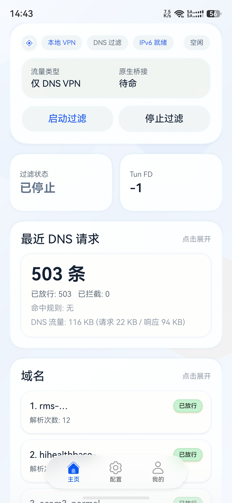

# 栖云盾 / home_cloud_shield

[简体中文](./README.md) | [English](./README-en.md)

<p align="center">
	
</p>


`栖云盾` 是一个面向 **HarmonyOS 6.0+** 的本地 DNS 过滤实验项目，使用 **DevEco Studio** 编译。应用通过本地 VPN 接管 DNS 流量，结合 **AdGuard 风格规则** 与原生桥接能力，用于验证 HarmonyOS 端的 DNS 拦截、规则管理、日志观察与开源合规分发流程。

项目地址：<https://github.com/Tlntin/home-cloud-shield>

当前仓库同时保留了：

- OpenHarmony / ArkTS 应用工程
- C/C++ / NAPI 原生桥接代码
- AdGuardHome 的 OHOS 移植工程
- 上游源码子模块与构建脚本

便于持续整理可复现构建链路，以及 GPL 对应源码与发布材料。

## 目录

- [获取体验包](#获取体验包)
- [项目概览](#项目概览)
- [过滤引擎现状](#过滤引擎现状)
- [应用截图](#应用截图)
- [功能特性](#功能特性)
- [当前限制](#当前限制)
- [适用场景](#适用场景)
- [暂不适用场景](#暂不适用场景)
- [开发路线](#开发路线)
- [仓库结构](#仓库结构)
- [快速开始](#快速开始)
- [构建说明](#构建说明)
- [开源与许可证](#开源与许可证)

## 获取体验包

- Releases：<https://github.com/Tlntin/home-cloud-shield/releases>
- 仓库主页：<https://github.com/Tlntin/home-cloud-shield>

如果你只是想先体验当前版本，建议优先从 Releases 页面获取现成安装包；如果你希望验证原生桥接、规则引擎或后续移植链路，再按下文说明自行构建。

### 安装工具

**小白调试助手**

**下载链接：**[Link](https://github.com/likuai2010/auto-installer/releases/latest)

小白调试助手（Auto-Installer）是一款免费、跨平台的鸿蒙应用开发调试工具。**如果你是直接下载 Releases 中的安装包，推荐优先使用这个工具安装。**

- [点击下载教程文档](https://github.com/Zitann/HarmonyOS-Haps/raw/refs/heads/main/assets/guide.pdf)
- [点击查看视频教程](https://www.bilibili.com/video/BV1hkZ7YnEMd/)

当然，你也可以直接使用 **DevEco Studio** 自行构建并安装。

### Release 包说明

- Releases 中的安装包文件名通常会体现 **模块名 / 构建产物类型 / 签名状态**。
- 若出现类似 `entry-default-unsigned.hap` 的文件名，一般表示这是 `entry` 模块生成的 **未签名 HAP**。
- `unsigned` 包更适合用于构建产物校验、流程验证或二次签名前检查；是否可直接安装，取决于你的设备环境与签名配置。
- 如果后续发布已签名或更适合分发的构建产物，建议优先以 Releases 页面的说明为准。

## 项目概览

应用当前包名为 `com.tlntin.home_cloud_shield`，应用名称为 **栖云盾**。

从工程结构与现有页面设计来看，项目主要围绕以下能力展开：

- 通过本地 VPN 接管 DNS 请求
- 以 AdGuard 兼容规则进行过滤与放行
- 提供规则导入、编辑、保存与导出能力
- 展示 DNS 请求、命中规则、域名排行与调试日志
- 保留开源授权页，便于发布时同步许可证材料

## 过滤引擎现状

当前应用运行时实际采用的是 `entry/src/main/cpp/vpnclient_bridge.cpp` 中的**轻量级 DNS 过滤实现**，而不是完整的 `AdGuardHome` 运行时。

仓库中的 `native/adguardhome-ohos-lib/` 目前主要用于：

- 保留 `AdGuardHome` 的 OHOS 移植工程与构建链路
- 验证共享库可编译性
- 为后续集成完整过滤内核做准备

出于**功耗、资源占用与移动端场景适配**的考虑，当前版本暂未在应用内直接启用完整 `AdGuardHome` 库作为默认过滤引擎。

后续计划是同时支持两套模式：

- **轻量级模式**：继续使用当前 C/C++ 实现，优先保证移动端常驻运行的功耗与响应速度
- **完整模式**：在条件成熟后，尝试内置完整 `AdGuardHome` 过滤能力，提供更高兼容性

### 当前轻量级规则引擎的兼容范围

当前实现是**部分兼容 AdGuard 风格 DNS 规则**，适合 DNS 域名过滤场景，但**不是完整兼容 `AdGuardHome`**。

已支持的主要能力：

- `@@` 白名单规则
- `||example.com` 这类域名后缀匹配规则
- `|example.com`、`|https://...` 这类前缀/起始匹配规则中的 DNS 域名相关用法
- `^` 分隔/截断语义的基础处理
- `*`、`*.` 形式的简单通配匹配
- `0.0.0.0 example.com`、`127.0.0.1 example.com`、`:: example.com`、`::1 example.com` 等 `hosts` 风格规则
- `$important`
- `$badfilter`
- `$dnstype=` 中的 `A` / `AAAA` 限制

当前未采用或未完整支持的部分包括：

- 完整 `AdGuardHome` 过滤内核能力
- 元素隐藏、页面注入等浏览器侧规则，例如 `##`、`#@#`、`#$#`
- 超出当前 DNS 域名匹配器范围的复杂规则组合与高级语法

因此，当前项目更准确的定位是：**兼容部分 AdGuard 风格 DNS 规则的 HarmonyOS 本地 DNS 过滤实验项目**。

## 应用截图

| 首页 | 配置页 | 我的 |
| --- | --- | --- |
|  |  |  |

## 功能特性

- **本地 DNS 过滤**：基于本地 VPN 模式接管 DNS 流量。
- **规则管理**：支持导入、编辑、启停、导出兼容 AdGuard 风格的 DNS 规则。
- **日志可视化**：查看最近 DNS 请求、命中规则、域名统计与调试日志。
- **原生桥接**：通过 `C/C++ + NAPI` 连接 OpenHarmony 应用层与底层处理逻辑。
- **多语言基础**：应用内已具备简体中文、English、繁體中文相关语言资源。
- **开源分发准备**：仓库保留 GPL 相关源码、第三方说明与子模块信息。

## 当前限制

- 当前过滤能力聚焦 **DNS 域名过滤**，并非完整网络层代理或完整 `AdGuardHome` 能力。
- 当前规则兼容性为**部分 AdGuard 风格 DNS 规则兼容**，不等同于完整语法覆盖。
- 由于项目依赖本地 VPN 扩展与原生桥接，当前更推荐在 **HarmonyOS 真机** 上验证。
- `native/adguardhome-ohos-lib/` 当前主要用于移植与构建验证，尚未作为默认运行时过滤内核接入应用。

## 适用场景

- 想验证 **HarmonyOS 上本地 VPN 接管 DNS** 的可行性。
- 想实验 **AdGuard 风格 DNS 规则** 在移动端轻量实现中的基本兼容性。
- 想研究 **ArkTS ↔ C/C++ ↔ NAPI** 的原生桥接方式。
- 想整理 **GPL 对应源码、第三方声明、移植工程与分发材料** 的开源发布链路。

## 暂不适用场景

- 期望它直接等同于桌面/路由器环境中的 **完整 AdGuardHome 成品体验**。
- 期望完整支持所有 **AdGuard 语法、浏览器元素隐藏、脚本注入或复杂策略组合**。
- 需要成熟稳定的 **全量代理、防火墙、企业级网络策略平台**。
- 需要“开箱即用、无需理解签名与设备环境”的最终消费级分发体验。

## 开发路线

- **近期**：继续完善轻量级 DNS 过滤引擎、规则管理体验、日志可视化与真机稳定性。
- **中期**：补充更清晰的规则兼容说明、构建产物说明，以及发布流程文档。
- **中长期**：评估在 HarmonyOS 端内置完整 `AdGuardHome` 过滤能力的成本与收益。
- **目标形态**：同时支持两套过滤模式——
	- **轻量级模式**：面向低功耗、移动端常驻与快速响应。
	- **完整模式**：面向更高规则兼容性与更完整的过滤能力。

## 仓库结构

```text
home_cloud_shield/
├── AppScope/                          # 应用级配置
├── entry/                             # OpenHarmony 主应用模块
│   ├── src/main/cpp/                  # C/C++ / NAPI 原生桥接
│   ├── src/main/ets/                  # ArkTS 页面与能力实现
│   └── src/main/resources/            # 资源、多语言、rawfile 等
├── native/
│   └── adguardhome-ohos-lib/          # AdGuardHome 的 OHOS 移植工程
│       ├── scripts/                   # 构建与上游同步脚本
│       └── third_party/AdGuardHome/   # 上游 AdGuardHome 子模块
├── LICENSE
├── THIRD_PARTY_NOTICES.md
└── README.md
```

### 关键目录

- `entry/`：OpenHarmony 应用工程主体。
- `entry/src/main/ets/pages/`：应用页面，例如主页与开源授权页。
- `entry/src/main/cpp/`：当前应用使用的原生桥接实现。
- `native/adguardhome-ohos-lib/`：AdGuardHome 的 OHOS 共享库移植工程。
- `native/adguardhome-ohos-lib/third_party/AdGuardHome/`：以上游 `AdGuardHome` 作为 git submodule 引入的源码目录。

## 快速开始

### 1. 获取完整源码

首次克隆时，建议直接连同子模块一起拉取：

```bash
git clone --recurse-submodules https://github.com/Tlntin/home-cloud-shield.git
```

如果已经普通克隆过仓库，请继续执行：

```bash
git submodule update --init --recursive
```

> 当前 `AdGuardHome` 子模块固定到 `v0.107.64`，用于与本仓库内的 OHOS 适配脚本保持一致。

### 2. 打开工程

请使用 **DevEco Studio** 打开仓库根目录进行编译：

- 根工程：`home_cloud_shield`
- 主模块：`entry`

## 构建说明

### 应用构建

当前项目面向 **HarmonyOS 6.0+**，可使用 **DevEco Studio** 按标准工程方式编译。工作区已提供常用任务：

- 最低兼容 SDK / API Version：`HarmonyOS 6.0.0(20)`
- 目标 SDK / API Version：`HarmonyOS 6.1.0(23)`
- 推荐使用已安装 `HarmonyOS 6.1.0(23)` SDK 的 **DevEco Studio** 版本进行编译与调试。
- 由于项目包含本地 VPN 扩展与原生桥接能力，当前建议在 **HarmonyOS 6.0+ 真机**上运行和验证，模拟器支持情况暂未验证。

- `栖云盾: 构建 entry HAP`
- `栖云盾: 安装并启动到设备(自动识别)`
- `栖云盾: 构建 + 安装并启动`

### 原生库构建

AdGuardHome OHOS 共享库相关脚本位于：

- `native/adguardhome-ohos-lib/scripts/build_ohos_shared.sh`
- `native/adguardhome-ohos-lib/scripts/update_third_party_adguardhome.sh`

SO 库构建细节请直接查看：

- [`native/adguardhome-ohos-lib/README.md`](./native/adguardhome-ohos-lib/README.md)

## 开源与许可证

本仓库按 `GPL-3.0-only` 发布。

主要原因是仓库中包含基于 `AdGuardHome` 的移植与修改版本，并与应用工程一起分发。完整许可证见：

- `LICENSE`
- `THIRD_PARTY_NOTICES.md`

应用内还保留了开源授权说明页与相关资源，用于后续发布校对：

- `entry/src/main/ets/pages/OpenSourceLicense.ets`
- `entry/src/main/resources/rawfile/adguard_open_source_licenses.txt`
